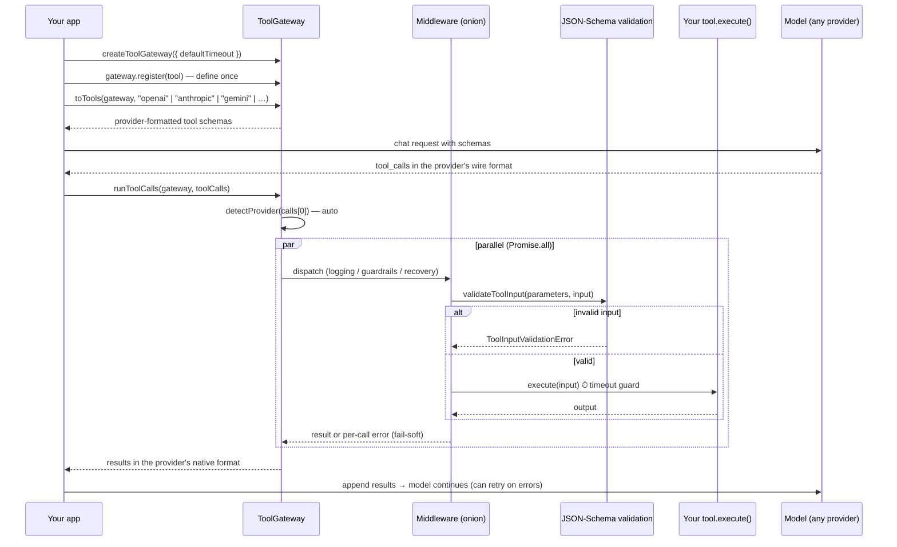

# 🌐 Tool Gateway

[](https://www.npmjs.com/package/@fourbits-studio/tool-gateway)
[](https://www.npmjs.com/package/@fourbits-studio/tool-gateway)
[](https://www.typescriptlang.org/)
[](https://opensource.org/licenses/MIT)
[](https://fourbits-studio.github.io/tool-gateway/)

> **Define your AI tools once. Run them anywhere.**  
> A lightweight, type-safe, and universal AI Tool Gateway for TypeScript, Node.js, and Bun.

---

## 💡 Why Tool Gateway?

Each AI provider uses a completely different format for tool calling:
- **OpenAI** requires `parameters` (JSON Schema) and returns JSON strings in `tool_calls`.
- **Claude** requires `input_schema` and communicates via `tool_use` / `tool_result` blocks.
- **Gemini** expects `functionDeclarations` and responds with `functionResponse`.
- **Cohere** uses its own `parameter_definitions` structure.
- **Vercel AI SDK** expects a dictionary object (`Record<string, CoreTool>`).

**Tool Gateway bridges them all.** Write your tool logic once, and effortlessly plug it into any model with automatic schema conversion, argument parsing, lifecycle middleware, and parallel execution.

```
                  ┌───► OpenAI / Groq / Ollama / DeepSeek
                  ├───► Anthropic (Claude)
   ToolGateway ───┼───► Google Gemini
 (Single Source)  ├───► Cohere
                  └───► Vercel AI SDK (`ai`)
```

---

## ⚡ Highlights

- 🧩 **One-Call API** – `runToolCalls(gateway, calls)` auto-detects the provider and `toTools(gateway, format)` exports any schema — two functions cover the whole loop.
- 🚀 **Zero Runtime Dependencies** – Microsecond execution overhead.
- 🛡️ **100% Type-Safe** – Full TypeScript generics and autocompletion.
- 🧅 **Onion-Style Middleware** – Built-in logging, latency tracking, guardrails, and error recovery.
- ⚡ **Parallel Execution** – First-class `Promise.all` support for batch tool calls across all providers.
- 🌐 **Cross-Runtime** – Works natively on Bun, Node.js (>=20), and Edge runtimes.

---

## 🧩 The One-Call API

Most of the time you only need **two functions**:

```typescript
import { createToolGateway, toTools, runToolCalls } from "@fourbits-studio/tool-gateway";

const gateway = createToolGateway({ defaultTimeout: 5000 });
gateway.register({
  name: "get_weather",
  description: "Get the current weather for a city",
  parameters: {
    type: "object",
    properties: { city: { type: "string" } },
    required: ["city"],
  },
  execute: ({ city }) => ({ city, temp: 30, condition: "Sunny" }),
});

// 1) Export the tool schemas in whatever format your provider needs
const tools = await toTools(gateway, "openai");        // or "anthropic" | "gemini" | "cohere" | "cohere-v2" | "vercel"
// → pass `tools` to your model call

// 2) When the model answers with tool calls, run them — one function, any provider
const results = await runToolCalls(gateway, modelToolCalls);
// Auto-detects OpenAI / Anthropic / Gemini / Cohere v1 call shapes and returns
// results in that provider's native format (with validation + timeouts applied).
// A failing tool never rejects the batch — its error is embedded so the model can retry.
```

`runToolCalls` also accepts `{ provider: "cohere-v2" }` (or any explicit provider) when you want to skip auto-detection — needed for Cohere v2, whose call shape is wire-identical to OpenAI but whose results use document blocks.

Every provider still has dedicated low-level functions (`toOpenAITools`, `executeAnthropicToolUsesSettled`, …) when you need finer control — see the [adapters reference](#adapters-reference) below.

---

## 🎬 See It Run — Live Execution Flow Demo

[Try the interactive demo →](https://fourbits-studio.github.io/tool-gateway/) — it runs this exact library in your browser (no API key needed) and animates the pipeline step by step: gateway → schema export → simulated model calls → auto-detection → middleware → validation → timeout → execution → results back to the model.

### How a call flows through the system



Step by step, in one sentence each:

1. **`createToolGateway`** — the single source of truth (tools, middleware, default timeout).
2. **`register`** — define a tool once: name, description, JSON Schema, `execute`.
3. **`toTools(gateway, format)`** — export the schemas in whatever wire format the model needs.
4. **Model responds** with tool calls in *its own* format (`tool_calls` / `tool_use` / `functionCall` / `parameters`).
5. **`runToolCalls`** auto-detects the provider from the call shape and picks the right executor.
6. Each call goes through the **middleware onion** (outermost → innermost): your logging/guardrail code → **input validation** → **timeout guard** → `tool.execute`.
7. Results are returned **in the provider's native format**, ready to append back to the conversation. Failures are embedded per-call (fail-soft), so the model can read the error and retry.

Runnable examples are in [`examples/`](./examples/):

```bash
bun run examples/agent-loop.ts                 # full loop, simulated model, no API key
bun run examples/middleware-and-production.ts  # logging, guardrails, timeouts, fail-soft
```

---

## 📦 Installation

```bash
# Bun
bun add @fourbits-studio/tool-gateway

# NPM
npm install @fourbits-studio/tool-gateway

# PNPM
pnpm add @fourbits-studio/tool-gateway
```

---

## 🚀 Quick Start (In 30 Seconds)

### 1. Define your Gateway and Tools

```typescript
import { createToolGateway } from "@fourbits-studio/tool-gateway";

export const gateway = createToolGateway();

gateway.register({
  name: "get_weather",
  description: "Get the current weather for a city",
  parameters: {
    type: "object",
    properties: {
      city: { type: "string" },
    },
    required: ["city"],
  },
  execute: ({ city }: { city: string }) => {
    return { city, temp: 30, condition: "Sunny" };
  },
});
```

---

## 🤖 Using with AI Providers

### 🌐 Vercel AI SDK (`ai`)
Pass your gateway tools directly into `generateText` or `streamText` (requires the [`ai`](https://www.npmjs.com/package/ai) package — the adapter loads it lazily, so other adapters stay dependency-free):

```typescript
import { generateText } from "ai";
import { openai } from "@ai-sdk/openai";
import { toVercelTools } from "@fourbits-studio/tool-gateway";
import { gateway } from "./gateway";

const { text } = await generateText({
  model: openai("gpt-4o"),
  prompt: "What's the weather in Bangkok?",
  tools: await toVercelTools(gateway), // That's it!
});
```

---

### 🟢 OpenAI & Compatible (Groq, Mistral, Ollama, DeepSeek)
Format tools for OpenAI and automatically parse arguments upon execution:

```typescript
import { toOpenAITools, executeOpenAIToolCalls } from "@fourbits-studio/tool-gateway";
import { gateway } from "./gateway";

// 1. Export schema to OpenAI API
const tools = toOpenAITools(gateway);

// 2. Execute parallel tool calls when model responds
const results = await executeOpenAIToolCalls(gateway, response.choices[0].message.tool_calls);
// Returns: [{ tool_call_id, content, output }, ...]
// `content` is a string ready to send back as the `role: "tool"` message;
// `output` is the raw value. Use executeOpenAIToolCallsSettled if one call
// must not fail the whole batch.
```

---

### 🟣 Anthropic (Claude)
Automatically maps `parameters` to Claude's `input_schema` and wraps results into `tool_result` blocks:

```typescript
import { toAnthropicTools, executeAnthropicToolUses } from "@fourbits-studio/tool-gateway";
import { gateway } from "./gateway";

// 1. Export tools for Claude API
const tools = toAnthropicTools(gateway);

// 2. Execute tool_use blocks returned by Claude
const results = await executeAnthropicToolUses(gateway, contentBlocks);
// Returns: [{ type: "tool_result", tool_use_id: "...", content: "{...}" }, ...]
```

---

### 🔵 Google Gemini
Formats tools into Gemini's `functionDeclarations` and wraps output into `functionResponse`:

```typescript
import { toGeminiTool, executeGeminiFunctionCalls } from "@fourbits-studio/tool-gateway";
import { gateway } from "./gateway";

// 1. Export tools to Gemini API
const geminiTools = [toGeminiTool(gateway)];

// 2. Execute function calls returned by Gemini
const responseParts = await executeGeminiFunctionCalls(gateway, functionCalls);
// Returns: [{ functionResponse: { name: "...", response: { ... } } }, ...]
```

---

### 🟠 Cohere

**Cohere v2** (`api.cohere.ai/v2/chat` — the current API) uses the OpenAI-compatible tool format. Use the `CohereV2` helpers:

```typescript
import { toCohereV2Tools, executeCohereV2ToolCalls } from "@fourbits-studio/tool-gateway";
import { gateway } from "./gateway";

const tools = toCohereV2Tools(gateway); // OpenAI-compatible `function` tools
const results = await executeCohereV2ToolCalls(gateway, toolCalls); // { tool_call_id, content: [{ type: "document", document: { data } }] }
```

**Cohere v1** (legacy) — transforms JSON Schema properties into Cohere's `parameter_definitions` using Python type notation (`str`, `int`, `float`, `bool`, `List[str]`, `Dict`):

```typescript
import { toCohereTools, executeCohereToolCalls } from "@fourbits-studio/tool-gateway";
import { gateway } from "./gateway";

const cohereTools = toCohereTools(gateway);
const results = await executeCohereToolCalls(gateway, cohereCalls);
```

---

## 🧅 Middleware Pipeline

Tool Gateway features an **Onion-Style Middleware** architecture (similar to Koa & Hono). Middlewares run for **both single and batch executions** across all providers.

```typescript
// 1. Logging & Latency Tracking
gateway.use(async (ctx, next) => {
  const start = performance.now();
  console.log(`[Tool Call] ${ctx.name}`, ctx.input);
  
  const result = await next();
  
  console.log(`[Tool Done] ${ctx.name} in ${(performance.now() - start).toFixed(2)}ms`);
  return result;
});

// 2. Guardrails (Short-circuit unauthorized commands)
gateway.use(async (ctx, next) => {
  if (ctx.name.startsWith("admin_")) {
    throw new Error("Access Denied: Admin tools cannot be invoked directly.");
  }
  return next();
});

// 3. Error Recovery (Prevent crashes)
gateway.use(async (_ctx, next) => {
  try {
    return await next();
  } catch (error) {
    return { ok: false, error: (error as Error).message };
  }
});
```

---

## 🛡️ Input Validation & Timeouts (Built-in)

Models sometimes emit malformed tool arguments. Tool Gateway guards against that out of the box:

- **Input validation** — when a tool declares a `parameters` JSON Schema, `gateway.execute` validates the model's input against it (zero-dependency validator supporting `type`, `required`, `properties`, `items`, `enum`, `additionalProperties`, `minimum/maximum`, `minLength/maxLength`, `pattern`, …). Invalid input throws a `ToolInputValidationError` *before* your `execute` runs — middleware can log or convert it into a retryable error for the model.
- **Timeouts** — bound any tool with a per-tool `timeout` (ms) or a gateway-wide `createToolGateway({ defaultTimeout: 5000 })`. A slow tool rejects with `ToolTimeoutError` instead of hanging your agent loop.
- **Fail-soft batches** — every adapter exposes a `…Settled` variant (`executeOpenAIToolCallsSettled`, `executeAnthropicToolUsesSettled`, `executeGeminiFunctionCallsSettled`, `executeCohereToolCallsSettled`, `executeCohereV2ToolCallsSettled`) that returns a per-call error in the provider's native result format instead of rejecting the whole batch — so the model can see the failure and retry.

```typescript
const gateway = createToolGateway({ defaultTimeout: 5000 });

gateway.register({
  name: "query_db",
  description: "Run a read-only SQL query",
  parameters: {
    type: "object",
    properties: { sql: { type: "string" } },
    required: ["sql"],
  },
  timeout: 3000, // overrides the gateway default for this tool
  execute: ({ sql }) => db.query(sql),
});
```

> Note: `description` is **required** on every tool — the Anthropic API rejects tools without one, and every provider uses it to decide when to call the tool.

---

## 📖 API Reference

### Core Gateway

| Method | Description |
| :--- | :--- |
| `createToolGateway()` | Factory function to instantiate a new `ToolGateway`. |
| `gateway.register(tool)` | Registers a new tool. Throws if the tool name already exists. |
| `gateway.use(middleware)` | Adds an onion-style middleware to the execution chain. |
| `gateway.execute(name, input)` | Executes a single tool through the middleware pipeline. |
| `gateway.executeMany(calls)` | Executes multiple tools concurrently using `Promise.all`. |
| `gateway.executeManySettled(calls)` | Like `executeMany`, but failures are reported per-call instead of rejecting the batch. |
| `gateway.has(name)` | Checks if a tool with the given name is registered. |
| `gateway.get(name)` | Retrieves a tool definition by name. |
| `gateway.getAll()` | Returns an array of all registered tool definitions. |
| `gateway.list()` | Returns a summary list of all tools (`name`, `description`). |

---

### Adapters Reference

| Adapter | Schema Exporters | Execution Functions | Output Format |
| :--- | :--- | :--- | :--- |
| **Vercel AI SDK** | `await toVercelTools(gateway)`<br>`await toVercelTool(gateway, tool)` | Handled natively by Vercel `tool.execute()` | Standard Output |
| **OpenAI** | `toOpenAITools(gateway)`<br>`toOpenAITool(tool)` | `executeOpenAIToolCall(gw, call)`<br>`executeOpenAIToolCalls(gw, calls)`<br>`executeOpenAIToolCallsSettled(gw, calls)` | `{ tool_call_id, content, output }` |
| **Anthropic** | `toAnthropicTools(gateway)`<br>`toAnthropicTool(tool)` | `executeAnthropicToolUse(gw, use)`<br>`executeAnthropicToolUses(gw, uses)` | `{ type: "tool_result", tool_use_id, content }` |
| **Google Gemini** | `toGeminiTool(gateway)`<br>`toGeminiFunctionDeclarations(gw)` | `executeGeminiFunctionCall(gw, call)`<br>`executeGeminiFunctionCalls(gw, calls)` | `{ functionResponse: { name, response } }` |
| **Cohere v2** | `toCohereV2Tools(gateway)`<br>`toCohereV2Tool(tool)` | `executeCohereV2ToolCall(gw, call)`<br>`executeCohereV2ToolCalls(gw, calls)` | `{ tool_call_id, content: [document] }` |
| **Cohere v1** (legacy) | `toCohereTools(gateway)`<br>`toCohereTool(tool)` | `executeCohereToolCall(gw, call)`<br>`executeCohereToolCalls(gw, calls)` | `{ call, outputs: [...] }` |

---

## 📄 License

[MIT](LICENSE) © [Fourbits Studio](https://github.com/Fourbits-Studio)